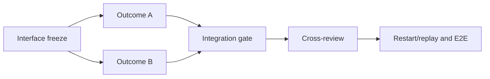

# maximize-plan-parallelism

A Codex skill that lets one main chat safely manage several AI helpers on a large coding job.

The main chat acts as the manager. It decides what must happen first, which tasks can run together, who may edit which files, and when the next step may start. If work cannot safely run in parallel, the skill keeps it sequential and explains why.

The technical model underneath is a dependency-safe DAG executed with native subagents inside one active Sol Ultra task.

## What it does

- Inspects the real repository, implementation plan, and acceptance criteria before decomposition.
- Builds a semantic dependency DAG and freezes shared interfaces before parallel consumers start.
- Splits work into independently observable outcomes with explicit task cards.
- Assigns owned paths, read-only inputs, forbidden paths, prerequisites, deliverables, and targeted verification.
- Detects shared hot files and prevents conflicting nodes from running in the same wave.
- Schedules capacity-aware waves without duplicating expensive test groups.
- Re-splits tasks that are too broad before implementation begins.
- Uses `integrated`, not `worker_done`, as the state that unlocks dependent work.
- Recovers after context compaction from a root-owned ledger and live-subagent reconciliation.
- Keeps integration, independent cross-review, restart/replay, and E2E evidence in the final stage.

## The control model



DAG edges represent semantic prerequisites. File conflicts, worker capacity, exclusive resources, and heavy-test groups are scheduling constraints. The skill keeps those concepts separate, so it does not invent dependencies merely to serialize unsafe work.

It also explains every dependency that remains sequential. If two tasks write the same indivisible hot file, consume an unfrozen interface, or require an unfinished producer, they do not run together.

## Testing strategy

Tests are layered, not postponed wholesale:

- workers run narrow checks for their own deliverables;
- the root verifies each node before integration;
- shared subsystem gates run after the relevant wave;
- the complete heavy suite, restart/replay, and E2E run once from the final integrated state.

This catches local failures early without making every worker repeat the same expensive suite.

## Install

Ask Codex:

```text
Use $skill-installer to install https://github.com/AyanbekDos/maximize-plan-parallelism/tree/main/skills/maximize-plan-parallelism
```

The skill becomes available on the next turn.

## Use

```text
Use $maximize-plan-parallelism for this repository and implementation plan.
Build and validate the DAG, then execute only dependency-safe waves with native subagents inside this active task.
```

The skill is designed for large implementation work. It deliberately stops after DAG validation when native subagents are unavailable, the root model requirement cannot be verified, or the request is read-only.

## Runtime requirements

- Codex with native subagent support.
- One active Sol Ultra root task.
- Python 3.10 or newer for the deterministic checker. It uses only the standard library.

No external scheduler or sidebar-task swarm is required. Runtime orchestration state is kept outside the repository under the user's Codex state directory.

## Validate a DAG

Run the checker self-test:

```bash
python skills/maximize-plan-parallelism/scripts/check_orchestration.py --self-test
```

Validate a plan and inspect derived waves:

```bash
python skills/maximize-plan-parallelism/scripts/check_orchestration.py path/to/dag.json --json
```

Replay the event ledger during execution or recovery:

```bash
python skills/maximize-plan-parallelism/scripts/check_orchestration.py path/to/dag.json --events path/to/events.jsonl --json
```

The initial release was independently forward-tested against two large implementation plans. One exposed a safe parallel review wave; the other correctly remained sequential because its implementation nodes shared central hot files. See [the sanitized forward-test report](validation/forward-tests.md).

## Repository layout

```text
skills/maximize-plan-parallelism/
  SKILL.md
  agents/openai.yaml
  references/dag-schema.md
  references/orchestration-contract.md
  scripts/check_orchestration.py
validation/forward-tests.md
```

## License

MIT
